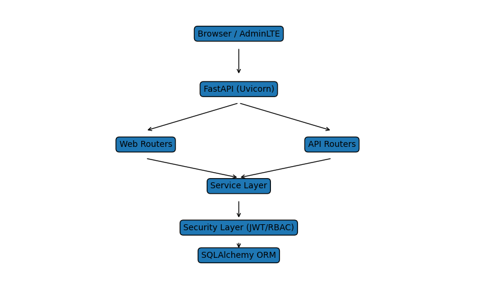

# Aula Robótica Platform

Backend de gestión de identidades, autenticación y control de acceso para el **Aula de Robótica de la Escuela Politécnica Superior (Universidad de Alcalá)**.

El sistema proporciona una infraestructura robusta de autenticación, autorización y administración de usuarios para las distintas actividades del Aula de Robótica, incluyendo el soporte a la competición **Eurobot Spain**.

Este proyecto forma parte del **Proyecto Final del CFGS en Desarrollo de Aplicaciones Multiplataforma (DAM)**.

---

# Objetivos del proyecto

Desarrollar una plataforma backend que permita:

- gestión centralizada de usuarios
- autenticación segura basada en JWT
- control de acceso mediante roles y permisos
- administración desde panel web
- trazabilidad completa mediante auditoría

---

# Tecnologías utilizadas

## Backend

-   Python
-   FastAPI
-   SQLAlchemy ORM
-   MariaDB

## Seguridad

- JWT (JSON Web Token)
- bcrypt (hash de contraseñas)
- RBAC (Role-Based Access Control)
- Sistema de permisos granulares

## Frontend administrativo

-   Jinja2
-   AdminLTE
-   Bootstrap

## Infraestructura

-   Uvicorn
-   entorno virtual con `uv`

---

# Funcionalidades principales

## Autenticación

- login con email y contraseña
- emisión de JWT con roles embebidos
- almacenamiento del token en cookie HTTPOnly

## Autorización

Sistema híbrido:

### Roles
- admin
- profesor
- estudiante

### Permisos
- create_user
- delete_user
- update_user
- view_dashboard
- manage_roles
- manage_identities

## Gestión de usuarios

-   creación de usuarios
-   activación / desactivación
-   eliminación
-   visualización de perfiles

## Gestión de identidades

Una identidad representa una credencial de acceso:

-   email
-   contraseña
-   proveedor de autenticación
-   asociación con usuario
-   rol contextual

## Gestión de roles

Sistema RBAC con roles configurables.

Roles actuales:

-   administrador
-   profesor
-   estudiante

## Panel administrativo

Interfaz web con AdminLTE para:

-   gestión de usuarios
-   gestión de identidades
-   gestión de roles
-   visualización de métricas

---

## Auditoría

Registro de eventos de seguridad:

-   login
-   logout
-   creación de usuarios
-   modificación de identidades
-   eliminación de recursos

Cada registro almacena:

- usuario
- acción
- recurso
- IP
- user agent
- timestamp

---

# Arquitectura del sistema

El sistema sigue una arquitectura modular en capas.

    Presentation Layer
            │
            ▼
    Web Controllers (FastAPI routers)
            │
            ▼
    Service Layer
            │
            ▼
    Persistence Layer (SQLAlchemy)
            │
            ▼
    Database (MariaDB)

    

---

# Modelo de datos

Entidades principales:

-   usuarios
-   identidades
-   roles
-   audit_logs

Relaciones principales:

    Usuario 1 ─── N Identidades
    Usuario N ─── N Roles
    Usuario 1 ─── N AuditLogs

---

# Decisiones de diseño

## Uso de JWT + cookies
Se decidió usar JWT almacenado en cookies HTTPOnly para:
- evitar almacenamiento en localStorage
- mejorar seguridad frente a XSS
- mantener compatibilidad con frontend server-side

## Roles en el token
Los roles se incluyen en el JWT para:
- evitar consultas a base de datos en cada request
- mejorar rendimiento

## Separación roles / permisos
Se implementa un sistema híbrido:
- roles → nivel alto
- permisos → control granular

Esto permite:
- escalabilidad futura
- desacoplar lógica de negocio

## Auditoría centralizada
Todas las acciones pasan por un servicio común:
- consistencia
- trazabilidad
- facilidad de extensión

---

# Trade-offs

## JWT sin invalidación central
Ventaja:
- rendimiento alto

Desventaja:
- no se puede invalidar fácilmente sin blacklist

## Roles en token vs base de datos
Ventaja:
- rapidez

Desventaja:
- cambios de roles requieren nuevo login

## Permisos en código (no en DB)
Ventaja:
- simplicidad inicial

Desventaja:
- menor flexibilidad futura

## Uso de Jinja en lugar de SPA
Ventaja:
- simplicidad
- rapidez de desarrollo

Desventaja:
- menor interactividad

---

# Posibles extensiones futuras

El sistema está preparado para integrar módulos adicionales:

-   gestión de proyectos
-   gestión de equipos
-   resultados y métricas
-   autenticación OAuth

---

# Ejecución del proyecto

Clonar repositorio:

    git clone https://github.com/fran-eliot/aula-robotica-platform

Instalar dependencias:

    uv sync

Ejecutar servidor:

    uvicorn app.main:app --reload

Servidor disponible en:

    http://127.0.0.1:8000

---

# Autor

Francisco Ramírez Martín

Backend Developer · Data Engineer en formación

LinkedIn\
https://linkedin.com/in/franeliot

GitHub\
https://github.com/fran-eliot
